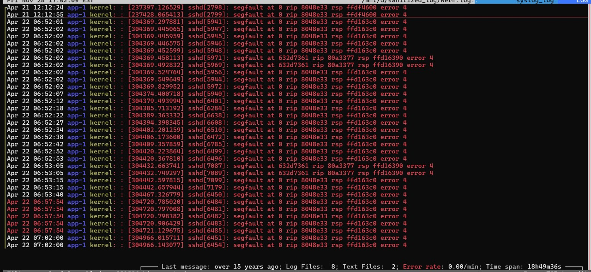
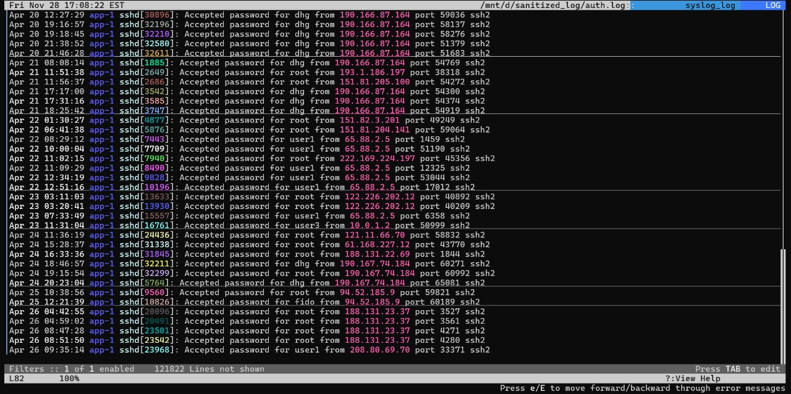
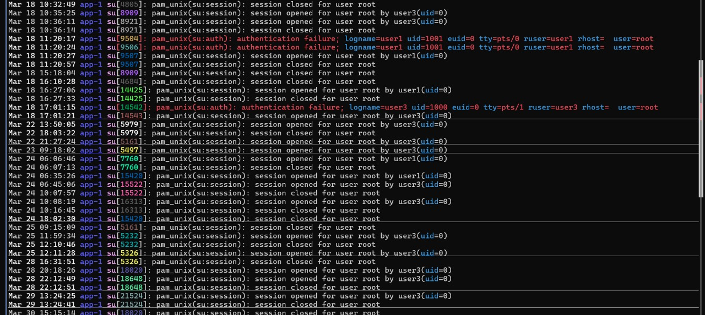
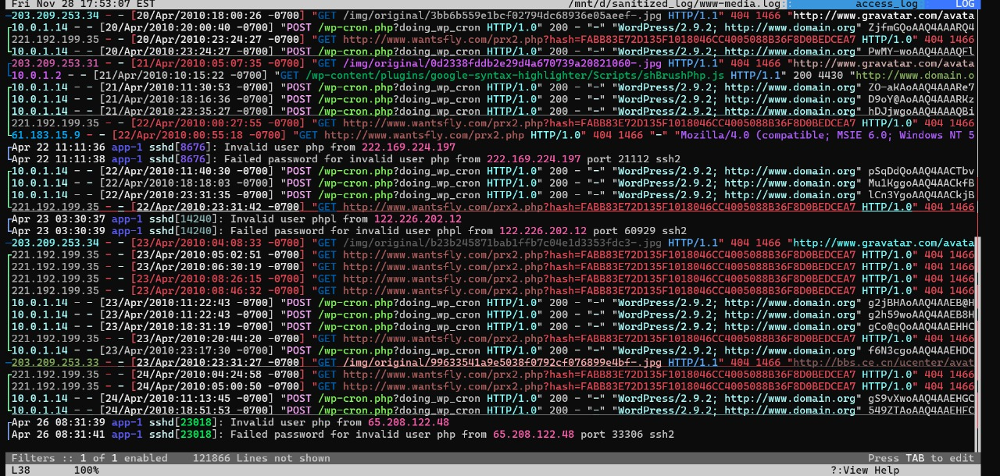
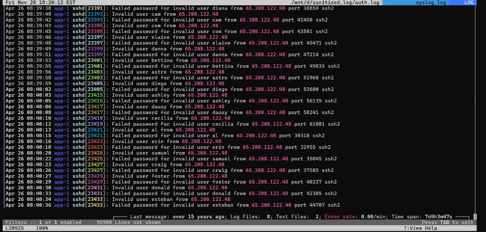

# BFOR519---Compromised-Server
# Overview 
The objective of our project was to analyse multiple Linux system logs to identify indicators of compromise on a potentially attacked server. Using LNAV for multi log correlation, we examined authentication behaviour, kernel errors, service activity, and HTTP requests across log files including auth.log, kern.log, daemon.log, and Apache logs.
Through targeted filtering, pattern detection, and cross log comparisons, we identified several red flags such as repeated SSH segmentation faults, abnormal service restarts, and suspicious web requests signals commonly associated with exploitation attempts or system tampering.
Our project demonstrated practical digital forensics and incident response skills by showing how real analysts detect suspicious activity, validate security concerns, and extract meaningful insights from raw system logs using open source tools.

# Project Relevance
While modern Linux systems generate huge volumes of logs, those logs are of little value until one knows what to make of them. Our project is relavent because it relates to bringing raw, unorganized log data into meaningful security insights something every cybersecurity professional should possess.
Through the examination of real system logs, this project helps develop practical skills such as recognizing suspicious patterns, associating events from different sources, and finding early signs of an attack. Tools such as LNAV is used in many real security operations centers; experience with these tools makes one more familiar with common industry workflows.
The investigation also underlines how misconfigurations, vulnerable services, or weak authentication settings are used by the attackers. Knowledge of such weaknesses reinforces the importance of system hardening and continuous monitoring to avoid similar compromises in the future.
Overall, the project emulates real-world work performed by SOC Analysts, Threat Hunters, DFIR Specialists, Red/Blue Teamers, and Cloud Security Engineers. This means skills learned here will directly apply to cybersecurity careers.

# Methodology
1. Environment Setup
Commands executed:  
•sudo apt update — Updates package list  
•sudo apt install lnav -y — Installs lnav  
•lnav --version — Confirms installation  

3. Tools Used  
•	Ubuntu / WSL for running commands  
•	lnav for log navigation and filtering  
•	sanitized_log directory containing raw log files  

4. Opening Logs in lnav  
•	lnav /mnt/d/sanitized_log/  
•	lnav automatically loads all supported log formats.  

5. Filters Applied (lnav)  
Inside lnav, the following filters were used: 
•	filter-in sshd.*segfault — Shows SSH segmentation faults  
•	filter-in accepted password — Shows successful SSH logins  
•	filter-in su:.*root — Shows privilege escalation attempts via su.  
•	filter-in php — Shows PHP-related log events  
•	filter-in invalid user — Highlights brute-force or unauthorized login attempts.  

# Screenshots & Evidence
# 1) sshd segfault  
Filter used : - :filter-in sshd.*segfault

# Evidence:  
Dozens of segfaults in sshd at the same memory address (RIP 8048e33), all within seconds, pointing to exploit attempts or binary corruption.  
The clustering of crashes across multiple PIDs shows instability triggered by repeated malicious inputs, not random system errors.  

# 2) accepted password  
Filter used : - :filter-in accepted password  
 
# Evidence: 
Multiple entries show “Accepted password for dhg” from IP 190.166.87.164 across different times, proving repeated external access.  
Direct root logins from IPs like 151.81.204.141 and 122.226.202.12, confirming attackers had full administrative control.  

# 3) su.*root  
Filter used : - filter-in su:.*root  
 

# Evidence: 
Multiple entries show “session opened for user root” by user1 and user3, confirming privilege escalation from non-root accounts.  
Authentication failures followed by successful su attempts highlight weak or shared root credentials being abused.  

# 4) php  
Filter used:- filter-in php  
 
# Evidence: 
Suspicious GET requests to wantsfly.com/prx2.php with hash parameters, indicating possible malicious probing or beaconing.  
WordPress activity (wp-cron.php, plugin scripts) alongside repeated 404s suggests attackers were testing vulnerable endpoints in the PHP stack.  

# 5) invalid user   
Filter used:- filter-in Invalid user   
 

# Evidence: 
Rapid sequence of “Invalid user” attempts from IP 65.208.122.48, cycling through usernames (diana, cam, astro, etc.) every few seconds.  
Each failed password attempt is paired with a port number, showing an automated tool systematically probing the server.  

# Indicators of Compromise (IOCs)
1.	Compromised Accounts  
•	root – multiple successful logins from external Ips  
•	dhg – repeated successful logins from 190.166.87.164 and 190.167.74.184  
•	user1 – successful logins from 65.88.2.5 and 208.80.69.70  
•	 fido – successful login from 94.52.185.9  
•	user3 – suspicious su activity to root  

2.	 Malicious IP Addresses  
•	Successful SSH Logins  
o	190.166.87.164  
o	190.167.74.184  
o	151.81.204.141  
o	151.81.205.100  
o	122.226.202.12  
o	88.214.26.70  
o	61.168.227.12  
o	94.52.185.9  
o	188.131.23.37  
o	65.88.2.5  
o	208.80.69.70  

3.	Brute-force Source  
•	65.208.122.48 (invalid user flood, rapid attempts across dozens of usernames).  

4.	System Instability  
•	Repeated sshd segfaults at memory address:  
•	RIP: 8048e33  
•	Error code: 4  
•	Pattern: Dozens of crashes in bursts, across multiple PIDs.  
5.	Web Layer Indicators  
•	Suspicious external requests to:  
•	wantsfly.com/prx2.php (with hash parameters)  
•	WordPress activity:  
•	wp-cron.php  
•	Plugin paths (e.g., google-syntax-highlighter)  
•	Frequent 404 probes against /img/original/... paths.  

6.	Behavioral Indicators  
•	Persistence: Repeated successful logins over multiple days from rotating IPs.  
•	Privilege Escalation: Frequent su attempts to root by user1 and user3.  
•	Brute-force: Automated spray attempts every 2 seconds from 65.208.122.48.  

# Key Findings 
1.	Direct Root Compromise  
•	Multiple successful SSH logins to the root account from external IPs.  
•	This confirms full system compromise with attackers gaining unrestricted control.  

2.	Multiple Account Breaches  
•	Accounts dhg, user1, and fido also show successful logins from suspicious IPs.  
•	Indicates broad credential exposure and attacker persistence across different user levels.  

3.	Brute-force Attack Evidence  
•	Source IP 65.208.122.48 launched rapid, automated login attempts against dozens of usernames.  
•	Confirms the server was exposed to internet-wide scanning and password-spray campaigns.  
4.	Privilege Escalation via su  
•	Frequent su attempts to root by user1 and user3, with failures followed by successes.   
•	Suggests lateral movement and exploitation of shared or weak root credentials.  
5.	System Instability (sshd segfaults)  
•	Kernel logs show repeated sshd segmentation faults at the same memory address.  
•	Strongly suggests exploit attempts or binary tampering, undermining system integrity.  

6.	Web Layer Exposure  
•	WordPress cron jobs and plugin activity observed.  
•	Suspicious external requests (e.g., wantsfly.com/prx2.php) and repeated 404 probes.  
•	Indicates attackers may have targeted or exploited the WordPress/PHP stack.  
7.	Persistence Across Days  
•	Successful logins and activity spread over multiple days.  
•	Attackers maintained ongoing access, not just a one-time intrusion.  

8.	Impact Assessment  
•	Confidentiality: All data exposed due to root access.  
•	Integrity: System binaries and configs likely tampered with.  
•	Availability: sshd crashes caused instability.  

# Recommendation
1.	Immediate Isolation   
•	Disconnect the server from the network to prevent further attacker activity.  
•	Disable all external SSH access immediately.  
2.	Full System Reinstallation (Mandatory)  
•	Due to confirmed root compromise, sshd crashes, and potential binary tampering, the operating system cannot be trusted.  
•	Perform a full OS reinstall on clean media.  
•	Do not reuse existing binaries, libraries, or configurations.  
3.	Credential Reset  
•	Reset all passwords for:   
o	System users  
o	Admin accounts  
o	WordPress / PHP application users  
o	Database accounts  
•	Ensure passwords meet strong complexity requirements.  
•	Rotate SSH keys and revoke compromised ones.  
4.	Rebuild SSH and Authentication Security  
•	Disable password authentication; use SSH keys only.  
•	Configure fail2ban or equivalent intrusion-prevention tools.  
•	Restrict SSH access to specific IP addresses if possible.  
5.	Harden Web Stack (WordPress/PHP)  
•	Reinstall WordPress and all plugins from trusted sources.  
•	Remove unused plugins and themes.  
•	Rotate database credentials.  
•	Review WP-Cron and plugin activity logs for backdoors.  
6.	Log and Forensic Review (Post-Rebuild)  
•	Compare all identified malicious IPs against new logs.  
•	Enable centralized logging and monitoring.  
•	Implement regular integrity checks (e.g., AIDE).  
7.	Network Security Improvements  
•	Place server behind a firewall.  
•	Limit exposed services only expose what is absolutely necessary.  
•	Add rate-limiting and geo-blocking where appropriate.  
8.	Long-Term Recommendations  
•	Enforce regular updates and patching.   
•	Enable 2FA for admin interfaces.   
•	Perform periodic security audits.  

# Conclusion
The investigation shows that the server was not secure and was accessed by outsiders in ways that should never have been possible. There are clear signs of repeated logins, suspicious activity from different places, and unusual behavior that points to the system being under someone else’s control. 
The activity wasn’t just a one time event it continued over several days, showing that whoever got in was able to stay connected and move around freely. Alongside this, there were signs of instability and probing of the server’s applications, which suggests the compromise went beyond simple password guessing. 
In short, the system was fully taken over. The safest path forward is to rebuild it from scratch, change all access credentials, and put stronger protections in place so this kind of incident cannot happen again.

